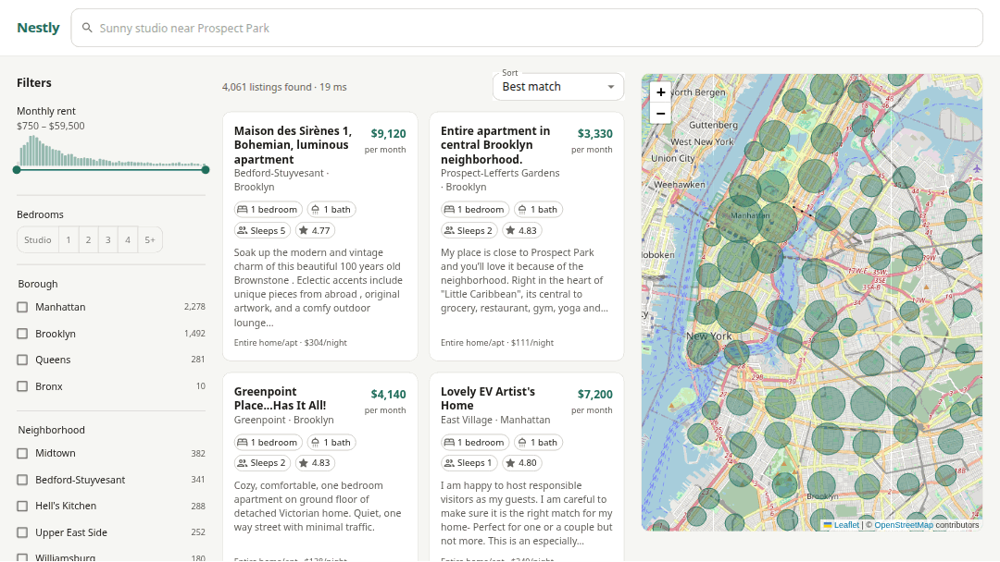
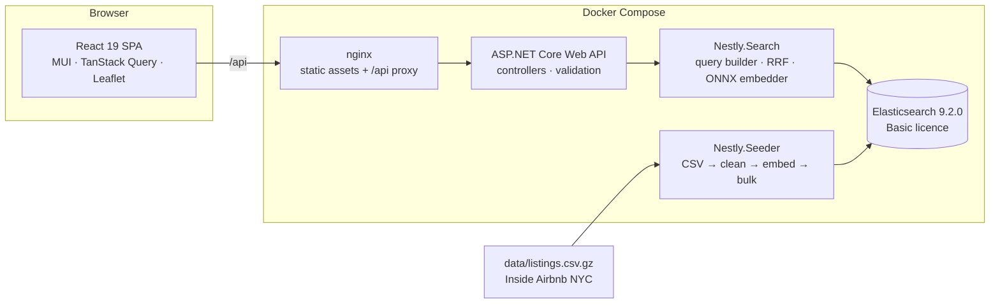

# Nestly

Search-as-you-type apartment finder for New York City — 5,000 real listings, hybrid
BM25 + vector retrieval on Elasticsearch, faceted filtering, and a live map. One command to run it.

[](https://github.com/HMalyhon/Nestly/actions/workflows/ci.yml)



Nestly is a demo application. It indexes 5,000 real New York City listings into Elasticsearch
and queries them as you type — once lexically, once by vector similarity over the listing
descriptions — then fuses the two rankings into one. Facets recount themselves as filters go on,
and the map redraws with whatever the query returns.

It runs from a single compose file on the free, perpetual Basic licence, with no API keys, no
model server and no dataset to download.

## Quickstart

```sh
docker compose up
```

Then open **http://localhost:8080**.

That is the whole setup, but the first run is not quick: it builds two images and downloads the
90 MB embedding model before it starts. Seeding then embeds and indexes 5,000 listings, which
takes **57 seconds** — and it costs that on every `docker compose up`, because the seeder drops
the index and rebuilds it rather than resuming. The page comes up before the index does, since
the API is healthy as soon as Elasticsearch answers, so give the seed a minute before searching
or watch `docker compose logs -f seeder`.

No API keys and no licence activation. The dataset is committed, so building the index fetches
nothing; the image build downloads the embedding model once, and the running page loads map
tiles from OpenStreetMap.

| | |
|---|---|
| Web | http://localhost:8080 |
| API | http://localhost:5080 — API reference at `/scalar`, OpenAPI document at `/openapi/v1.json`, health at `/health` |
| Elasticsearch | http://localhost:9200 |

## Architecture



Every Nestly request goes to the app's own origin: nginx serves the built SPA and proxies `/api`
to the API container, and under `npm run dev` Vite proxies the same path server-side. So there is
no cross-origin call to configure in either flow, and the CORS policy earns its keep only for the
`VITE_API_BASE_URL` escape hatch that points a local UI at an API elsewhere. The one third-party
request the page makes is map tiles, fetched straight from OpenStreetMap.

`Nestly.Search` is the only assembly that declares the Elasticsearch package, and it owns the
mapping, the query DSL, the fusion and the embedder — which is what keeps the query logic
unit-testable and the controllers thin. The client type itself surfaces in exactly two places
outside it: the API's health-check ping and the seeder's bulk loop.

## How search works

Typing is debounced at 200 ms. Every search with text in the box then runs **two retrievals in
parallel against the same filters**, and fuses them:

1. **Lexical** — a `best_fields` `multi_match` over `title^3`, `description` and
   `neighborhood.text`.
2. **Vector** — a `knn` query over a 384-dimension `dense_vector` holding an embedding of the
   listing description, produced by **all-MiniLM-L6-v2 running in-process via ONNX Runtime**.
   The query text is embedded the same way, on the request path — no model server, no sidecar.

Typeahead is a separate, cheaper endpoint: `/api/listings/suggest` reads a `search_as_you_type`
sub-field on the title and a `completion` suggester on the neighbourhood, so the dropdown never
pays for the hybrid pipeline.

The two lists cannot simply be added together: BM25 returns unbounded scores that shift with the
corpus and the query, while kNN returns a normalised cosine score in `[0, 1]`. So they are merged
by **Reciprocal Rank Fusion** — `score = Σ 1/(k + rank)`, `k = 60` — which discards the scores and
keeps only the positions, the one thing the two lists genuinely share. Each result carries the leg
that found it (`Lexical`, `Vector` or `Both`) on the API response — useful when judging whether
the hybrid layer is earning its keep, though the UI does not draw the tag yet.

An empty search box skips the vector leg altogether and browses on filters alone; there is nothing
to embed, and BM25 has nothing to rank.

The payoff is queries that no keyword search can answer. *"somewhere quiet to write"* has almost
no lexical overlap with the listings it should return; the vector leg finds them, and RRF pushes
anything **both** legs agree on to the top.

## Elasticsearch notes

### Licensing: nothing here expires

The obvious way to build this is the `rrf` retriever plus `semantic_text`, and both lean on
features gated above Basic. On Basic they return a licence error, and the only way to "unlock"
them is a 30-day trial — which is exactly how a public repo ends up working for a month and then
breaking for everyone who clones it afterwards.

| Feature | What a Basic cluster answers | Used here |
|---|---|---|
| `rrf` retriever (native RRF) | `403` — `non-compliant for [Reciprocal Rank Fusion (RRF)]` | **No** — fused in ~50 lines of C# instead |
| `_inference`, which ELSER and `semantic_text` need to embed | `403` — `non-compliant for [inference]` | **No** — ONNX embeddings instead |
| `dense_vector` + `knn` | works | **Yes** |

Both 403s above are verbatim from the cluster this repo starts, not quoted from a pricing page. A
`semantic_text` *mapping* is in fact accepted on Basic — it is the inference endpoint behind it
that is not, which leaves the field inert.

Both replacements are honest trades rather than compromises. Implementing RRF yourself is a
[pure function](src/Nestly.Search/Ranking/RrfFusion.cs) with [its own unit
tests](tests/Nestly.UnitTests/Ranking/RrfFusionTests.cs), and embedding in .NET removes the
Python sidecar a managed inference endpoint would otherwise need.

### Facets count what you have not selected yet

Each facet is a `global → filter → values` aggregation that re-applies **every filter except its
own** — six count with `terms`, while rent uses a `min`/`max`/`histogram` triple. The `global`
escapes the search query so the facet can ask a different question than the result list did.
Without it, picking Brooklyn makes the other four boroughs read zero and nobody can widen a
search without clearing it first.

Amenities are the deliberate exception, because that filter is conjunctive: its own dimension
stays applied, so the count reads *"how many of my current results also have this"* — the number
that actually answers whether ticking the box is worth it.

### What honest facet counts cost

Server-side `elapsedMs` against the seeded 5,000-document index, 30 warm samples each:

| Request | p50 | p90 |
|---|---|---|
| Filters only, no text | 5 ms | 8 ms |
| `"brooklyn"` | 36 ms | 54 ms |
| `"brooklyn loft"` | 46 ms | 66 ms |
| `"brooklyn loft"` + a borough filter | 51 ms | 66 ms |

Filters are nearly free; free text costs seven to ten times as much, and the cause is the facet
design above — seven `global → filter` aggregations each re-run the text query to count their own
dimension. That is the price of counts that stay honest when a filter is applied, and at this
scale it is worth paying. The lever, if it ever needs pulling, is the front end: facets only have to be
recomputed when filters change, not on every keystroke of a query that leaves them alone.

### The map switches representation at 500

At **500** matches or fewer the response carries individual pins; above that, a `geotile_grid`
aggregation two zoom levels finer than the map itself, each cell with a count and a median rent.
Handing Leaflet 5,000 markers is what makes these maps feel broken.

One Elasticsearch request computes both and the response carries whichever the total calls for.
Asking for the count first would have cost a second round trip on every pan.

The map and the result list are separate endpoints on purpose — panning must not re-transfer
descriptions, amenities and vectors for every visible listing.

## Data

Real [Inside Airbnb](https://insideairbnb.com/) data for New York City, snapshot **2026-08-10**,
by Murray Cox — licensed **CC BY 4.0**, and **modified**: trimmed from 30,234 rows × 90 columns
to a committed 5,000 × 17 subset.

**One field is derived.** Inside Airbnb is short-term rental data priced per night, so there is
no monthly rent to read; `monthlyRent = pricePerNight × 30`. It is the only value the pipeline
derives, and it runs high — the median works out at $6,540/month — because nightly rates bake in
turnover and margin. A smaller multiplier would look better and would be a fudge factor chosen
to look good, which is worse than an obvious ×30. **Treat the rents as demo data, not market
data.** One other substitution is worth naming: two of the 5,000 rows have no `minimum_nights`,
and the mapper defaults those to 1. Nothing else is invented — no square footage, no no-fee flag,
and no dates beyond the source's own `last_review`, which is indexed but never used as a facet,
however natural those facets would be for an apartment search.

Full provenance, the exact upstream URL, every transform and the reasoning behind committing the
file are in **[data/README.md](data/README.md)**. Regenerate it byte-identically — fixed sample
seed, sorted by id, zeroed gzip timestamp — with `dotnet run --project tools/Nestly.DataTrimmer`,
once the 15 MB upstream snapshot is in `data/raw/`. That file is gitignored, and the tool prints
the `curl` command to fetch it when it is missing.

## Layout

```
.github/       The CI workflow
data/          Trimmed Inside Airbnb subset + provenance
docker/        Dockerfiles and the nginx config
docs/          The demo gif
models/        Embedding weights. Gitignored; written by tools/Nestly.ModelFetcher
src/
  Nestly.Domain/    Contracts. No dependencies.
  Nestly.Search/    ES client, index mapping, query builders, RRF, ONNX embedder
  Nestly.Api/       Controllers, validation, OpenAPI, health
  Nestly.Seeder/    CSV → clean → embed → bulk index
  Nestly.Web/       React SPA
tests/
  Nestly.UnitTests/         Pure logic, no I/O
  Nestly.IntegrationTests/  Testcontainers + a real Elasticsearch
tools/         DataTrimmer, ModelFetcher
```

## Development

```sh
dotnet run --project tools/Nestly.ModelFetcher   # 90 MB, verified against recorded SHA-256
docker compose up -d elasticsearch
dotnet run --project src/Nestly.Seeder
dotnet run --project src/Nestly.Api              # http://localhost:8080
cd src/Nestly.Web && npm ci && npm run dev       # http://localhost:5173, proxies /api
```

## Tests

```sh
dotnet run --project tools/Nestly.ModelFetcher        # or five vector tests skip themselves
dotnet test --project tests/Nestly.UnitTests
dotnet test --project tests/Nestly.IntegrationTests   # needs a Docker daemon
```

**131 unit tests** cover the parts worth pinning down in isolation — RRF fusion, the emitted
query DSL, HTML cleaning, amenity mapping, geo maths, request validation. **28 integration
tests** run against a real Elasticsearch 9.2.0 started by Testcontainers and seeded with 1,000
listings from the committed dataset, because facet counts, pagination and hybrid ranking are claims
about Elasticsearch's behaviour and a mock would only assert what the mock was told. Five of the
28 assert on the vector leg and skip themselves when the embedding model is absent, so fetch it
first or you will quietly run 23.

Line coverage across both suites is **63.4%**, excluding generated OpenAPI scaffolding — a figure
meant to be read rather than celebrated, since the classes worth covering are the ones the unit
tests target: `RrfFusion`, `GeoDistance` and `HtmlText` at 100%, `AmenityCatalog` 97.6%,
`ListingQueryBuilder` 95.6%, `ListingMapper` 94.1%. Wiring, options classes and controllers pull
the total down. Reproduce it by adding `-- --coverage --coverage-output-format cobertura` to each
`dotnet test` above and merging the two reports.

CI runs both suites, the front-end lint/typecheck/build and a full image build — on every push to
`main` and every pull request against it. Pushes to other branches run nothing.

## Deliberately deferred

Considered and left out, so the roadmap is visible rather than absent:

- **`_explain` relevance-debug panel** — show the BM25 breakdown and each leg's rank per hit.
  The single most useful thing to add next.
- **Learning to rank** and **decay scoring** on recency and distance.
- **Index aliases + zero-downtime reindex.** The seeder deletes and recreates, which is right
  for a demo and wrong for anything with users.
- **Selecting a listing *from* the map needs a pointer.** Leaflet gives `tabIndex` to marker icons
  but not to `Path` subclasses, so the circle markers cannot take focus. The list drives the map by
  keyboard already — each result card is a button that selects its pin — but the reverse direction,
  and clearing a selection by clicking the background, are mouse-only.
- **`eslint-plugin-jsx-a11y`** — 6.10.2 is the latest release and peers `eslint ^3 … ^9`, against
  this repo's ESLint 10. Installing it with `--legacy-peer-deps` would write an untested
  combination into the lockfile for CI and the web image to reproduce, which is worse than not
  having the rules. The accessibility work is verified by hand in a browser instead of guarded.

## Licence and attribution

- Code: [MIT](LICENSE).
- Data: Inside Airbnb, [CC BY 4.0](http://creativecommons.org/licenses/by/4.0/), modified —
  see [data/README.md](data/README.md).
- Map tiles: © [OpenStreetMap](https://www.openstreetmap.org/copyright) contributors, served
  best-effort under the [OSMF tile usage policy](https://operations.osmfoundation.org/policies/tiles/).
  Suitable for a demo, **not for traffic** — point `VITE_MAP_TILE_URL` at your own provider
  before deploying anything real, and change `VITE_MAP_TILE_ATTRIBUTION` with it.
- [Leaflet](https://leafletjs.com/) is BSD-2-Clause; [all-MiniLM-L6-v2](https://huggingface.co/sentence-transformers/all-MiniLM-L6-v2)
  is Apache-2.0.
